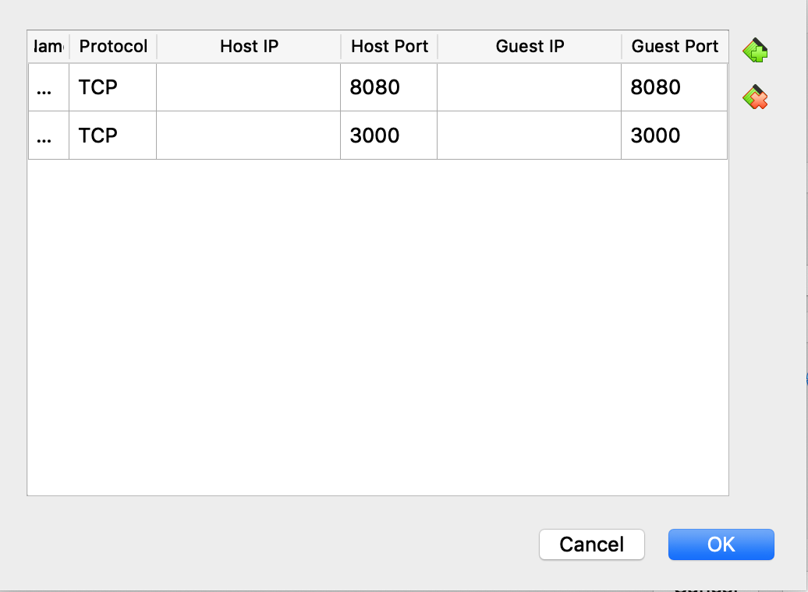

# Help Docs of Running the project

## Getting start

To install the project on your machine, you have three options.
- Install natively using Yarn
- Install using docker (This docker doesn't contain the automatically run, in fact it contains a code server which you can write code directly in your browser)
- Using VM (This actually is running docker inside the VM for windows user. If you are using unix system like MacOS, you can ignore this)


# Install using Docker

(1) First, get [docker](https://docs.docker.com/docker-for-mac/install/)

(2) Get docker-compose. Note, if you install docker using above link on MacOS, you don't have to install docker compose.

(3) Run command
```
docker-compose up
```


# Install using VM

First, download the VM using this [link](https://github.com/sirily11/Senior-Design/releases/tag/0.1.0). Note, the vm file is SeniorDesign.ova

Second, Install VitualBox


Finally, doing the following steps to import VM and run the VM.

## Config VM

(1) First in your VitualBox click File > Import Appliance > clicked the little file icon on screen and select the VM file


(2) After VM has been imported, click VM and then click settings. Go to Network tab and click Adapter 1


Click portforwarding. Then have your settings match the scrrenshot



(3) Start Vm then go to Senior-Design folder. In that folder, run 
```bash
sudo docker-compose up
```

Then, go to your home screen on your computer, open browser and enter
```
0.0.0.0:8080 
```
or
```
localhost:8080
```

Then you will have the following screen.


