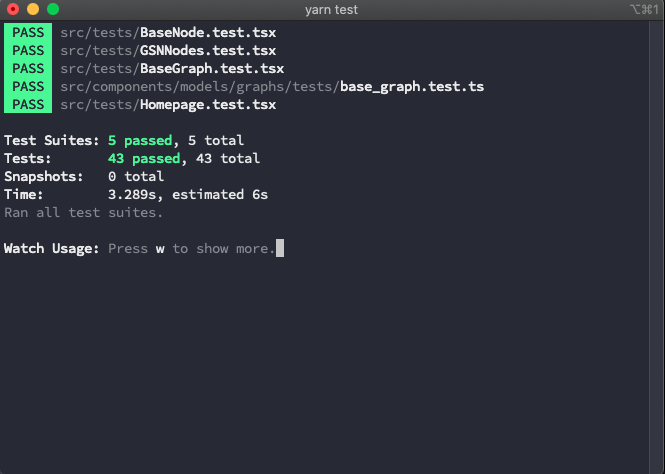

# Testing

Our project utilizes Jest for testing. Tests can be written anywhere in the project and detected by jest when you run `yarn test`.

When you enter `yarn test`, you will be greeted by the following interface, which runs your entire test suit for the project. You can keep Jest running in the background as you work on development, and with each change, the tests will be run to make sure they are all passing. The image below contains 5 different files that contain a total of 43 tests.



A simple test example can be found below.

```javascript
describe("Test Goal to Solution and Context", () => {
    let cNode: NodeObj =        { id: "2", title: "context", description: "Context Node", nodeType: NodeTypes.context, connection: []}
    let sNode: NodeObj =        { id: "1", title: "solution", description: "Solution Node", nodeType: NodeTypes.solution, connection: []}
    let goalNode: NodeObj =     { id: "0", title: "Root", description: "Root Node", nodeType: NodeTypes.goal, connection: [sNode, cNode] }

    let graph = new BaseGraphObject({ _id: "test_graph", name: "Test", description: "Test graph", nodes: [goalNode, sNode, cNode] })

    test("Test Context Parent", () => {
        expect(graph.nodes[0]).toBe(graph.nodes[2].parent)
    })

    test("Test Solution Parent", () => {
        expect(graph.nodes[0]).toBe(graph.nodes[1].parent)
    })

    test("Check Context Type", () => {
        expect(graph.nodes[2].nodeType).toBe("CONTEXT")
    })

    test("Check Solution Type", () => {
        expect(graph.nodes[1].nodeType).toBe("SOLUTION")
    })

    test("Check Goal Type", () => {
        expect(graph.nodes[0].nodeType).toBe("GOAL")
    })
})
```